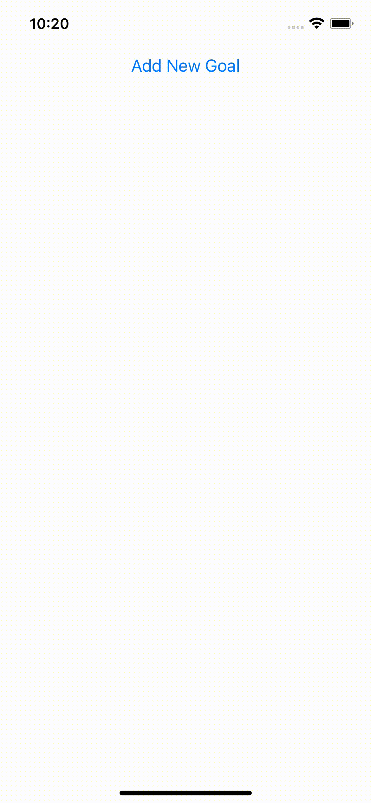

# Course Goals App
## Basic Example to add Goals into the list in React Native

## Functionality of App
- Show up modal to input goals
- Add input goals into the list
- Delete goals from list
- Cancel to close modal

## Sample Implementation
- Styles
- Flexbox
- State(useState - hook) & Events
- Splitting App into Components
- Passing data between component 
- FlatList
- Touchable
- Modal